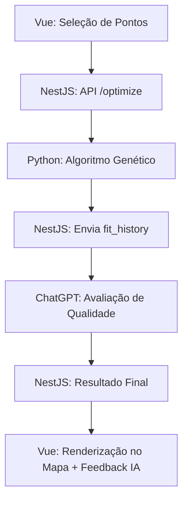

# 🚚 Route Optimizer — Monorepo

Uma plataforma completa para **otimização de rotas logísticas inteligentes**, combinando **Algoritmos Genéticos**, **análise com IA (ChatGPT)** e **visualização interativa** em mapa.  
O sistema foi projetado para resolver o problema de distribuição de entregas de forma **eficiente, inteligente e adaptável** — equilibrando rotas, priorizando pedidos urgentes e aproveitando o poder da IA para avaliar a qualidade das soluções geradas.

---

## 🧠 Visão Geral do Algoritmo

A estrutura do algoritmo foi pensada para **equilibrar eficiência e inteligência logística**.  
O fluxo segue uma lógica adaptativa que considera **prioridades, agrupamento geográfico e capacidade de veículos**:

### 🔹 Quando há prioridades definidas:
1. O sistema **forma pares de entregas prioritárias**, garantindo que cada rota comece com **duas prioridades distintas**.  
   Isso evita que um único veículo concentre todas as entregas críticas, reduzindo o risco de falhas importantes.
2. Após formar os pares, o algoritmo busca **pontos não prioritários próximos** (usando a fórmula **Haversine** para calcular a distância por raio geográfico).  
   Esses pontos “secundários” são agregados à rota prioritária, criando trajetos otimizados e geograficamente coerentes.
3. Por fim, os pontos restantes (sem prioridade) são distribuídos para completar as rotas.

### 🔹 Quando não há prioridades (ou pares insuficientes):
O sistema atua em dois modos possíveis:
- **Modo automático:** utiliza o algoritmo **K-Means** para identificar o número ideal de clusters (rotas/veículos).  
- **Modo controlado:** utiliza limites de **mínimo e máximo de veículos** definidos pelo usuário, mantendo o equilíbrio entre performance e custo operacional.

### 🔹 Avaliação com IA:
Após a execução do **Algoritmo Genético**, o **backend envia o histórico de fitness (fit_history)** para o **ChatGPT**, que **avalia a qualidade e a consistência das rotas geradas**, fornecendo feedback textual sobre eficiência, convergência e possíveis melhorias.

---

## 🧩 Estrutura do Monorepo

```

/web/       → Aplicação Vue 3 (frontend com Google Maps)
/api/       → API NestJS (backend que executa o Python e comunica com a IA)
/log-ai/    → Núcleo Python (algoritmo genético de otimização logística)

````

---

## 🚀 Funcionalidades

### 🗺️ **Frontend (web - Vue 3 + Google Maps)**
- Interface interativa para **selecionar e visualizar pontos de entrega**.  
- Exibe **rotas otimizadas** com cores distintas.  
- Permite múltiplas rotas (multi-veículo).  
- Comunicação em tempo real com o backend (HTTP).  
- Leve, responsiva e de fácil uso.

---

### ⚙️ **Backend (api - NestJS)**
- Intermediário entre o frontend, o motor Python e o ChatGPT.  
- Recebe dados do mapa (pontos, prioridades, parâmetros GA).  
- Executa o script Python via `child_process.spawn` e coleta o retorno JSON.  
- Envia o histórico de fitness ao **ChatGPT**, que avalia a qualidade das rotas.  
- Retorna ao frontend tanto o **resultado técnico** quanto a **avaliação textual da IA**.

#### 🔧 Variáveis de ambiente (`.env`)
Antes de rodar o backend, copie o arquivo `.env.example`:

```bash
cd api
cp .env.example .env
````

Edite os valores conforme necessário:

```bash
GOOGLE_MAPS_API_KEY=        # usada para cálculos de rota e distância
CORS_ORIGINS=http://localhost:5173
OPENAI_API_KEY=             # usada para avaliação de qualidade via ChatGPT
```

> O backend requer o Python instalado localmente e o diretório `log-ai` acessível.

---

### 🧬 **Optimizer (log-ai - Python)**

* Núcleo do **Algoritmo Genético** de otimização de rotas.
* Implementa as funções:

    * `generate_population` — cria rotas iniciais.
    * `calculate_fitness` — mede a distância total (aptidão).
    * `tournament_selection` — seleciona candidatos melhores.
    * `order_crossover` — cruza rotas boas para gerar novas.
    * `mutate` — faz pequenas variações nas rotas.
* Suporte a **pontos fixos** (`lock_start`, `lock_end`).
* Retorna JSON com:

  ```json
  {
    "best_route": [0, 3, 1, 2],
    "best_distance": 14235.9,
    "fit_history": [18000.4, 16543.2, 15432.8]
  }
  ```
* **Não precisa ser executado manualmente** — o backend NestJS o chama automaticamente.

#### 🧩 Instalação das dependências Python

```bash
cd log-ai
pip install -r requirements.txt
```

---

## 🧠 Fluxo de Dados

```
🗺️ Frontend (web)
   ↓
📡 Envia pontos, prioridades e parâmetros
   ↓
⚙️ Backend (api)
   ↳ Executa Python (log-ai)
   ↳ Recebe best_route + fit_history
   ↳ Envia fit_history para ChatGPT
   ↓
🤖 IA (ChatGPT)
   ↳ Avalia qualidade e eficiência da rota
   ↓
⚙️ Backend (api)
   ↳ Combina resultado técnico + análise IA
   ↓
🗺️ Frontend (web)
   ↳ Exibe rotas otimizadas e feedback inteligente
```

> O backend funciona como o “cérebro integrador”, conectando cálculo matemático (Python) com raciocínio linguístico (IA).

---

## 🛠️ Como rodar o projeto

### 1. Clone o repositório

```bash
git clone https://github.com/felipewww/ai-pos-2 route-optimizer
cd route-optimizer
```

---

### 2. Instale dependências do **backend (api - NestJS)**

```bash
cd api
cp .env.example .env   # configure as variáveis
npm install
npm run start:dev
```

> A API roda em `http://localhost:3000`
> Endpoints:
>
> * `POST /optimize` → recebe pontos e parâmetros, retorna rota e avaliação IA
> * `GET /health` → status do serviço

---

### 3. Instale dependências do **optimizer (log-ai - Python)**

```bash
cd log-ai
pip install -r requirements.txt
```

> ⚙️ Não é necessário executar o script manualmente — o NestJS o aciona automaticamente.

---

### 4. Inicie o **frontend (web - Vue)**

```bash
cd web
npm install
npm run dev
```

> O frontend estará disponível em `http://localhost:5173`
> e se comunicará automaticamente com o backend (`localhost:3000`).

---

## 🧩 Exemplo de entrada (enviada ao backend)

```json
{
  "points": [
    {"lat": -23.22209, "lng": -45.88547, "priority": true},
    {"lat": -23.22045, "lng": -45.89396, "priority": true},
    {"lat": -23.22581, "lng": -45.88881, "priority": false}
  ],
  "population_size": 500,
  "generations": 200,
  "mutation_rate": 0.1,
  "lock_start": true,
  "lock_end": true
}
```

---

## 🧩 Exemplo de resposta (retornada ao frontend)

```json
{
  "best_route": [0, 2, 1],
  "best_distance": 2314.22,
  "fit_history": [2450.1, 2340.8, 2314.2],
  "ai_evaluation": "A rota apresenta boa convergência e distribuição equilibrada das prioridades. Pequenas melhorias possíveis na segunda geração."
}
```

---

## 🌐 Tecnologias principais

| Camada             | Tecnologia             | Descrição                        |
| ------------------ | ---------------------- | -------------------------------- |
| **Frontend**       | Vue 3, Google Maps API | Visualização interativa          |
| **Backend**        | NestJS, Node.js        | Orquestração e integração IA     |
| **Optimizer**      | Python 3 + NumPy       | Algoritmo Genético               |
| **IA**             | ChatGPT (OpenAI API)   | Avaliação inteligente das rotas  |
| **Infraestrutura** | Monorepo               | Integração modular entre camadas |

---

## 📊 Diagrama de Fluxo Simplificado



---

## 💡 Próximos Passos

* [ ] Implementar cache para execuções repetidas.
* [ ] Adicionar análise comparativa entre gerações.
* [ ] Exibir gráficos de evolução do fitness no frontend.
* [ ] Docker Compose para automação do ambiente.

---

## 🧠 Autor

Desenvolvido por **Felipe Barreiros**
💻 Full-stack Engineer • Data, IA & Optimization Enthusiast

